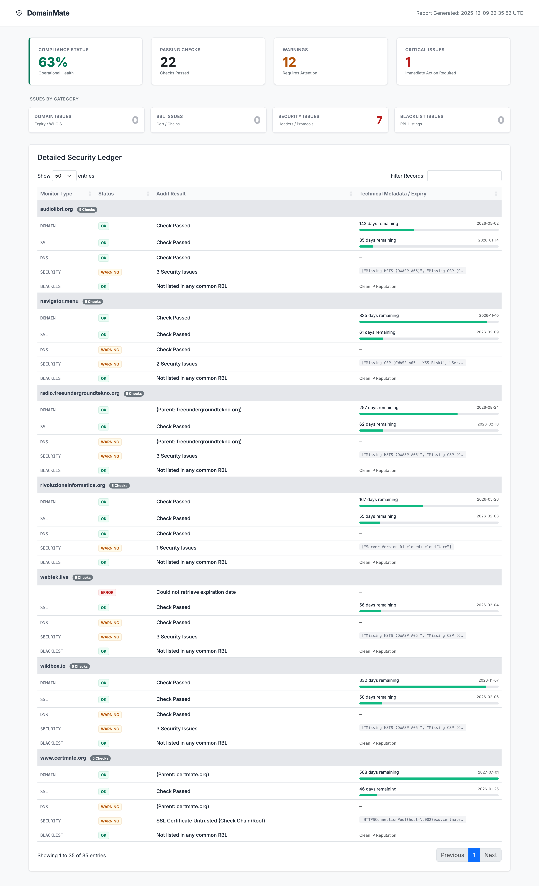

# DomainMate

DomainMate is a domain and security monitoring system designed for high resilience and comprehensive asset auditing. It provides monitoring capabilities through robust DNS resolution strategies, deep SSL inspection, and hybrid blacklist monitoring.



## Overview

The system is engineered to function in restricted network environments, utilizing DNS-over-HTTPS (DoH) failover mechanisms to bypass local resolver issues or firewalls. It performs in-depth analysis of domain health, including:

*   **Domain Validity**: Tracks WHOIS expiration dates with intelligent parent domain awareness.
*   **SSL/TLS integrity**: Validates certificate chains, expiration dates, and detects deprecated protocols (SSLv3, TLS 1.0/1.1).
*   **DNS Security**: Audits SPF, DMARC, and DKIM records for email security compliance.
*   **Reputation Monitoring**: checks IP reputation against major RBLs (Real-time Blackhole Lists) using a hybrid resolution strategy to differentiate between blocking and listing.
*   **Security Posture**: Analyzes HTTP headers for OWASP recommended configurations (HSTS, CSP, X-Frame-Options) and information leakage.

## Architecture

DomainMate is built on Python 3.12 and follows a modular architecture designed for containerized deployment.

*   **Core Engine**: AsyncIO-based execution for concurrent checks.
*   **Resilience Layer**: Custom `RobustResolver` implementing a pool of public DNS providers (Cloudflare, Google, Quad9) with automatic DoH fallback.
*   **Reporting**: Generates static, self-contained HTML reports with DataTables integration for client-side filtering and grouping.
*   **Notification System**: Centralized dispatcher supporting GitHub Issues, GitLab Issues, Telegram, Microsoft Teams, Email, and generic Webhooks, featuring state management for alert aggregation and frequency control.

## Installation

### Prerequisites

*   Python 3.12 or higher
*   Docker (optional, for containerized execution)

### Local Setup

A `Makefile` is provided for standardizing operations.

```bash
# Initialize virtual environment and install dependencies
make install

# Run the audit scan
make run
```

### Docker Deployment

```bash
# Build the container image
make docker-build

# Execute the container
make docker-run
```

## Configuration

Configuration is managed via `config.yaml`. Sensitive parameters can be overridden via Environment Variables for secure CI/CD integration.

### File Configuration (`config.yaml`)

```yaml
domains:
  - example.com
  - monitor.io

monitors:
  domain:
    enabled: true
    expiry_warning_days: 30
  ssl:
    enabled: true
  blacklist:
    enabled: true
    
reports:
  output_dir: "reports"
  retention_days: 30
```

### Environment Variables

The following environment variables takes precedence over file configuration:

| Variable | Description |
|----------|-------------|
| `DOMAINMATE_CONFIG_FILE` | Path to valid configuration file (default: config.yaml) |
| `GITHUB_TOKEN` | GitHub Personal Access Token for issue creation |
| `GITHUB_REPO` | Target GitHub repository (user/repo) |
| `GITLAB_TOKEN` | GitLab Private Token |
| `TELEGRAM_BOT_TOKEN` | Telegram Bot API Token |
| `TEAMS_WEBHOOK_URL` | Microsoft Teams Connector URL |
| `GENERIC_WEBHOOK_URL` | Endpoint for JSON alert payloads |

## CI/CD Integration

### GitLab CI

Include the provided `.gitlab-ci.yml` template in your repository to enable automated daily scanning pipelines.

### GitHub Actions

The repository includes a workflow in `.github/workflows/deploy.yml` configured to execute scans on a daily schedule (08:00 UTC) and publish reports as build artifacts.

## CLI Usage

The system can be invoked directly via the Command Line Interface:

```bash
python src/cli.py --config /path/to/config.yaml --notify
```

**Options:**
*   `--config`: Path to the configuration file (overridden by `DOMAINMATE_CONFIG_FILE`).
*   `--notify`: Enable dispatching of notifications to configured channels.
*   `--demo`: Generate a report using mock data for demonstration purposes.

## License

This software is released under the MIT License.
